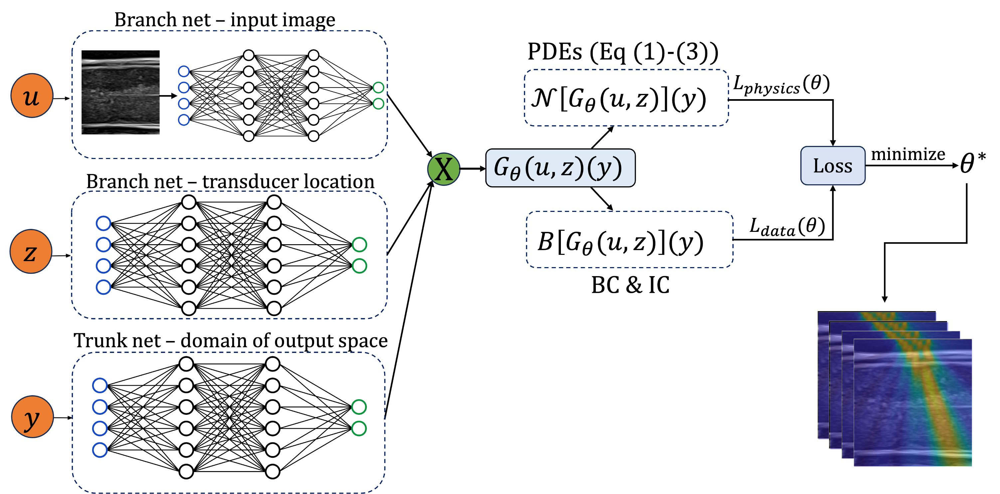

## A new way to both optimize and personalize spinal cord injury treatment

---

This research focuses on developing a pipeline to enable personalized treatment plans for spinal cord injury. Understanding where to place a focused ultrasound transducer in surgery to optimize therapeutic effect requires computational simulations. Numerical solvers take too long to generate the necessary pressure maps, taking up to 5 hours to provide accurate results. The time and cost-intensive nature of this approach is unfeasible for intraoperative use-cases. My approach uses a physics-informed Deep Operator Network trained on simulated pressure maps in the spinal cord to predict the output pressure distribution for a given patient in a matter of seconds. Regularized by physical constraints, this novel architecture learns the mappings between the patient-specific anatomy and the solution for the governing wave equation (pressure distribution) to approximate the overarching operator. This presents a paradigm-shifting solution to personalizing spinal cord care, overcoming the computational burden of running several expensive simulations. 

This work is under preparation and will be available online soon! 

---